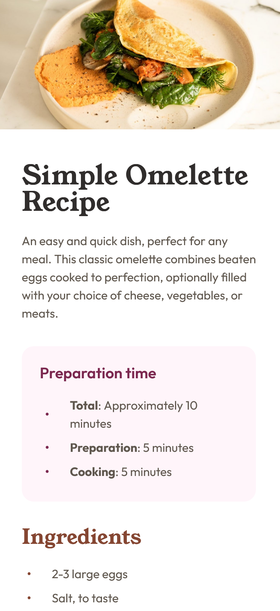
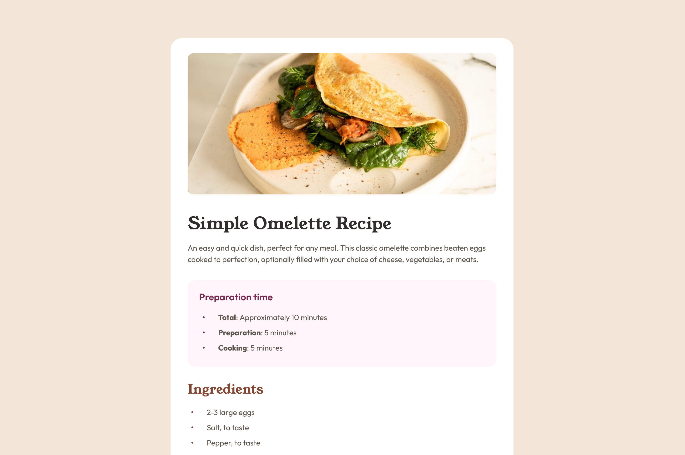

# Recipe page

This is a solution to the [Recipe page challenge on Frontend Mentor](https://www.frontendmentor.io/challenges/recipe-page-KiTsR8QQKm).

## Overview

### Screenshots

| _Mobile Screenshot (375x812)_                            | _Desktop Screenshot (1440x960)_                             |
| -------------------------------------------------------- | ----------------------------------------------------------- |
|  |  |

### Live demo

- Live Site URL: [here](https://michele-cini.github.io/recipe-page/)

## My process

### Tech used

- HTML5
- CSS3
- Git
- GitHub
